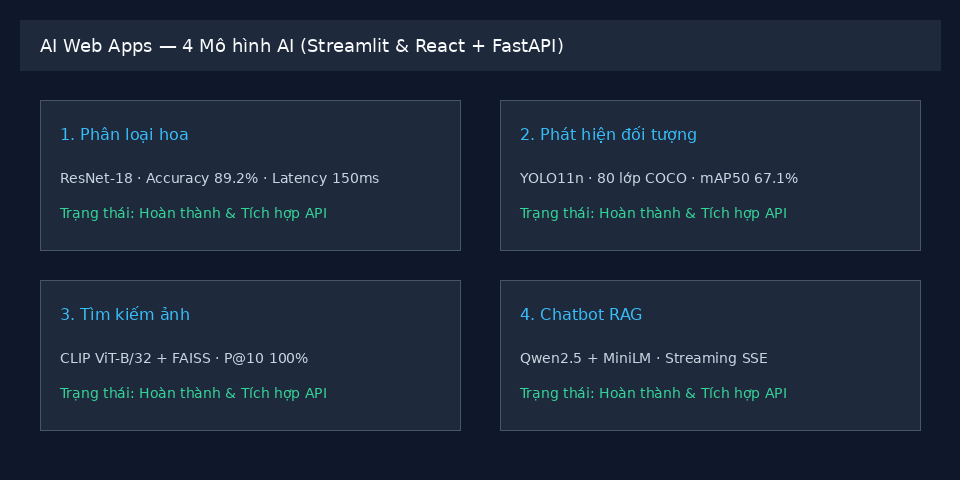
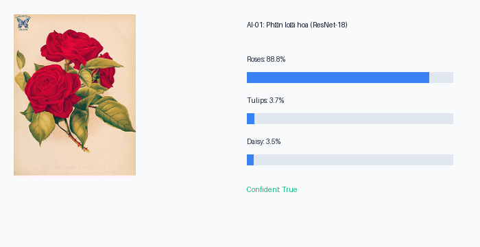
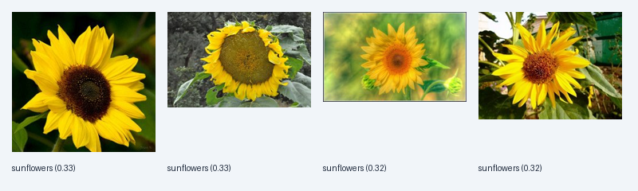

# AI Web Apps — Streamlit & React

Bốn ứng dụng AI (phân loại hoa ResNet-18, phát hiện đối tượng YOLO11n, tìm kiếm ảnh CLIP+FAISS, chatbot RAG Qwen2.5) sau một backend FastAPI, với hai giao diện: Streamlit và React (Vite).



## Demo các tính năng AI

| 1. Phân loại hoa (ResNet-18) | 2. Phát hiện đối tượng (YOLO11n) |
| :---: | :---: |
|  |  |
| **3. Tìm kiếm ảnh (CLIP + FAISS)** | **4. Chatbot RAG (Qwen2.5 + MiniLM)** |
|  | Streaming SSE + Trích dẫn nguồn tài liệu `[file.md]` |

## Chạy trên máy (Python 3.11, Node 22)
```bash
pip install -r requirements.txt                       # CPU: cài torch bản CPU trước (xem Dockerfile)
# File nặng (*.pt, *.faiss, data/gallery, data/flowers, data/coco128) không push git:
bash scripts/download_artifacts.sh                    # tải tất cả models + flowers + coco128
# Tùy chọn nâng cao:
# python3 scripts/download_all.py --models            # chỉ tải models từ Drive
# python3 scripts/download_all.py --flowers           # chỉ tải TF Flowers
# python3 scripts/download_all.py --coco128           # chỉ tải COCO128
# python3 scripts/download_all.py --force             # ghi đè file nếu đã có

uvicorn api.main:app --port 8000 --reload             # backend; mở http://localhost:8000/docs (Swagger)
API_URL=http://localhost:8000 streamlit run streamlit_app.py  # Streamlit (API-only client): http://localhost:8501
cd web && npm install && npm run dev                  # React dev: http://localhost:5173 (proxy /api → :8000)
cd web && npm run build                               # build xong, FastAPI phục vụ luôn React ở http://localhost:8000/
python -m pytest -q tests                             # test mocked, không cần GPU/model thật
```
Máy yếu: `ENABLED_MODELS=classifier,detector uvicorn api.main:app --port 8000` để nạp ít model.

## Hiệu năng & Benchmark (OPS-02)

Đo lường bằng `scripts/benchmark.py` (chạy trên CPU Intel/AMD thông thường):

| Endpoint | Chức năng | p50 (ms) | p95 (ms) | Tỷ lệ thành công |
|---|---|---|---|---|
| `GET /api/health` | Kiểm tra hệ sinh thái & model | 2.95 ms | 3.58 ms | 100% |
| `POST /api/classify` | Phân loại hoa ResNet-18 | 157.66 ms | 166.71 ms | 100% |
| `POST /api/detect` | Nhận diện vật thể YOLO11n | 372.94 ms | 1560.97 ms | 100% |
| `POST /api/search/text` | Vector search CLIP + FAISS | 37.55 ms | 43.57 ms | 100% |

- **Mức tiêu thụ tài nguyên:** RAM RSS ~3.5GB khi bật toàn bộ 4 mô hình đồng thời (kèm causal LM); ~700MB khi chỉ bật classifier + detector.

## Biến môi trường (xem `config.py`, mẫu ở `.env.example`)
| Biến | Mặc định | Ý nghĩa |
|---|---|---|
| `ENABLED_MODELS` | `classifier,detector,retrieval,llm` | Mô hình được nạp |
| `LLM_MODEL` | `Qwen/Qwen2.5-1.5B-Instruct` (GPU) / `-0.5B-` (CPU) | Mô hình sinh |
| `EMBED_MODEL` | `sentence-transformers/paraphrase-multilingual-MiniLM-L12-v2` | Embedding cho RAG |
| `CLIP_MODEL` | `openai/clip-vit-base-patch32` | Tìm kiếm ảnh |
| `YOLO_WEIGHTS` | `artifacts/detector/yolo11n.pt` | Weights YOLO |
| `OPENAI_API_BASE` / `OPENAI_API_KEY` / `OPENAI_MODEL` | _(trống)_ / `dummy` / = `LLM_MODEL` | Endpoint OpenAI-compatible tùy chọn cho chat |
| `MAX_UPLOAD_MB` | `8` | Giới hạn ảnh upload |
| `CORS_ORIGINS` | `http://localhost:5173,http://localhost:8501` | Origin được gọi API |
| `PORT` | `8000` | Cổng backend |
| `API_URL` | `http://localhost:8000` | (Streamlit) địa chỉ backend |

## Chatbot RAG qua OpenAI-compatible endpoint
```bash
export OPENAI_API_BASE=https://<provider>/v1
export OPENAI_API_KEY=...
export OPENAI_MODEL=...
uvicorn api.main:app --port 8000
```
Kiểm tra alias khả dụng qua `GET /api/chat/models`.

## API (Swagger: `http://localhost:8000/docs`)
| Endpoint | Input | Output |
|---|---|---|
| `GET /api/health` | — | `{"status","version","device","models"}` |
| `POST /api/classify` | `multipart file`, `top_k` (1–5) | `{"predictions":[{"label","score"}],"confident"}` + header `X-Process-Time-ms` |
| `POST /api/detect` | `multipart file`, `conf` (0.05–0.95) | `{"detections":[{"label","score","box_xyxy"}],"summary","image":"data:image/jpeg;base64,…"}` |
| `POST /api/search/text` | `{"query","k"}` (k 1–24) | `{"results":[{"id","score","label","url"}]}` |
| `POST /api/search/image` | `multipart file`, `k` | như trên |
| `GET /api/gallery/{id}` | id | file ảnh tĩnh |
| `POST /api/chat` | `{"question"/"message","history","model","base_url","api_key"}` | SSE `text/event-stream`: `sources` → `token`* → `done` |
| `POST /api/chat/sync` | như trên | `{"answer","sources"}` (non-streaming) |
| `GET /api/chat/models` | — | `{"models":[…]}` |

Thiếu model → `503`, file sai → `400`, body sai → `422`.

## Docker
```bash
docker build -t ai-web-apps . && docker run -p 7860:7860 ai-web-apps   # mở http://localhost:7860
```

Chỉ số mô hình: xem `MODEL_CARD.md` và `artifacts/*/metrics.json` —
classifier test-acc 0.948 / macro-F1 0.947, detector mAP50 0.6707 / mAP50-95 0.5034 (COCO128),
RAG Hit@1 0.9286 / Hit@3 1.0 (14 câu hỏi mẫu).
